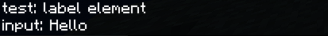
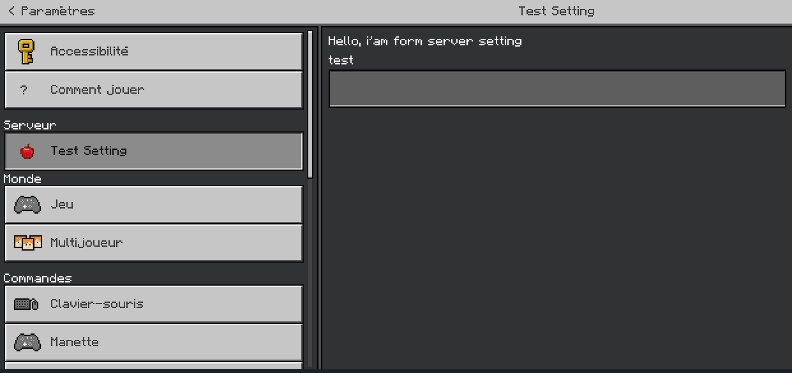

# FormAPI | PowerNukkitX

Simple library for creating forms (MCBE PowerNukkitX)

<br/><br/>
## Examples:

### SimpleForm

-----------------------------------

```java
SimpleForm simpleForm = new SimpleForm((targetPlayer, data) -> {
        targetPlayer.sendMessage(data == null ? "null" : data.toString()); // return "diamond" if click in button Hello because has label "diamond" else null for exit form
});
simpleForm.setTitle("From with label");
simpleForm.setContent("i'am a SimpleForm");
simpleForm.addButton("Hello", ImageType.PATH, "textures/items/diamond", "diamond");
simpleForm.send(event.getPlayer());
```

<br/>
is clicked in button Hello
<br/>

<br/>
is exit of form
<br/>

### CustomForm

-----------------------------------

```java
CustomForm customForm = new CustomForm((player, data) -> {
        ifdata == null) return;
        player.sendMessage("test: " + data.get(0).toString()); // return label element
        player.sendMessage("input: " + data.get("input1")); //return input send by client
});
customForm.setTitle("It`s a title");
customForm.addLabel("label element");
customForm.addInput(new ElementInput("Input button"), "input1");
customForm.send(event.getPlayer());
```         


### ModalForm

-----------------------------------
```java
ModalForm form = new ModalForm((targetPlayer, data) -> {
        if(data == null) return;
        targetPlayer.sendMessage(data.toString());
});
form.setTitle("It`s a title");
form.setContent("Sample text");
form.setButtonTrue("Positive button");
form.setButtonFalse("Negative button");
form.send(player);
```

### Form in Server Setting

-----------------------------------
handler is run after leave setting
```java
CustomForm customForm = new CustomForm((player, data) -> {
        if(data == null) return;
        player.sendMessage("test: " + data.get(0).toString()); // return Hello, i'am form server setting
        player.sendMessage("input: " + data.get("test")); //return input send by client
});
customForm.setTitle("Test Setting");
customForm.addLabel("Hello, i'am form server setting");
customForm.setIcon(ImageType.PATH,"textures/items/apple");
customForm.addInput(new ElementInput("test"), "test");
customForm.setFormSetting(event.getPlayer());
```

<br/>
After the processing phase, it defaults to the values sent by the client.
<br/>


## Import in Maven or gradle

-----------------------------------
### Maven
````xml
<repositories>
    <repository>
        <id>jitpack.io</id>
        <url>https://jitpack.io</url>
    </repository>
</repositories>
````
````xml
<dependency>
    <groupId>com.github.SenseiTarzan</groupId>
    <artifactId>FormAPI-PNX</artifactId>
    <version>1.0.1</version>
</dependency>
````
### Gradle
```kotlin
repositories {
    mavenCentral()
    maven {
        name = "jitpack"
        url = uri("https://jitpack.io")
    }
}

dependencies {
    compileOnly("com.github.SenseiTarzan:FormAPI-PNX:1.0.1")
}
```